# Citewise Postgraduate Research Management Application

## Overview

Citewise postgraduate research management application will automate consultant assignments, quotation, communication, and document exchange. Provide students with clear, timely service delivery and progress visibility. Help consultants manage their workload and deliver feedback efficiently. Equip admins with dashboards and performance analytics to improve decision-making and service quality.

## Group Members
- Akhilesh Parshotam - ST10281011
- Erin Chisholm - ST10279615
- Connor Tre Van Buuren - ST10275455
- Ethan Ruey Huntley - ST10399453
- Alicia Orren - ST10265835

## Features

### User Authentication
- Secure login and registration using Firebase Authentication
- Password recovery functionality
- User profile management


### Role-Based Features

## Student Features

### 1. Student Dashboard
- Displays a list of all service requests the student has submitted.
- Each request shows key information such as service type, title, priority, date submitted, deadline, and current status 
- Students can see feedback and quotations uploaded by the consultant for each request.

### 2. Request a Service Page
- Allows students to submit a new service request.
- Students can enter request details (e.g., service type, description, uplaod document, urgency and deadline).
- Once submitted, the request appears on the dashboard and in the "View All Submitted Requests" page.

### 3. View All Submitted Requests Page
- Shows a full list of all the student’s requests in one place.
- Students can filter requests by urgency: **High**, **Medium**, or **Low**.
- Helps students quickly find and track specific requests based on how urgent they are.

### 4. Resources Page
- Students can view a list of resources uploaded by the admin (e.g., guides, templates, documents).
- Each resource can be opened or downloaded.
- Resources can be filtered by **faculty** to show only relevant content.
- A search function allows students to search for resources by document name.

## Consultant Features

### 1. Consultant Dashboard
- Displays all service requests assigned to the consultant.
- Each request shows key information such as service type, title, date submitted, deadline, urgency and current status.
- Includes a **Workload Priority** summary that shows the percentage of assigned tasks by urgency level 
- Helps consultants quickly understand their current workload and which tasks are most urgent.

### 2. View All Tasks Page
- Shows a full list of all tasks/requests assigned to the consultant.
- Consultants can filter tasks by urgency: **High**, **Medium**, or **Low**.
- Makes it easier to focus on urgent tasks first or organise work by priority.

### 3. Request Details & Document Handling
- When the consultant clicks on an assigned request, they are taken to a detailed view of that request.
- The details page shows:
  - Student’s request information
  - Any additional notes provided by the student.
- The consultant can:
  - **Download** the document uploaded by the student.
  - **Upload** a new document back to the student.


## Admin Features

### 1. Admin Dashboard
- Displays an overview of the system, including:
  - Total number of registered students.
  - Total number of registered consultants.
- Admins can:
  - View a list of **pending consultants**.
  - Approve or reject consultant registration requests.
  - View a list of **approved consultants** currently active on the system.

### 2. Manage Consultants
- Allows the admin to **assign consultants to student service requests**.
- Helps ensure that service requests are distributed to the appropriate consultants.

### 3. Resources Page
- Admins can view all resources they have uploaded to the system.
- Includes filtering options:
  - Filter resources by **faculty**.
  - Search for a resource by **name/title**.
- Makes it easier to manage and maintain learning materials, guides, and templates.

### 4. Add Resource Page
- Allows the admin to add new resources to the system.
- The admin can:
  - Enter the **title** of the resource.
  - Select a **category**.
  - Select the **faculty** the resource belongs to.
  - Upload a file as the resource.
- Once added, resources become available to students on the Resources page.


## Screenshots

### Student Dashboard
 

 ### Student Submit Requests
  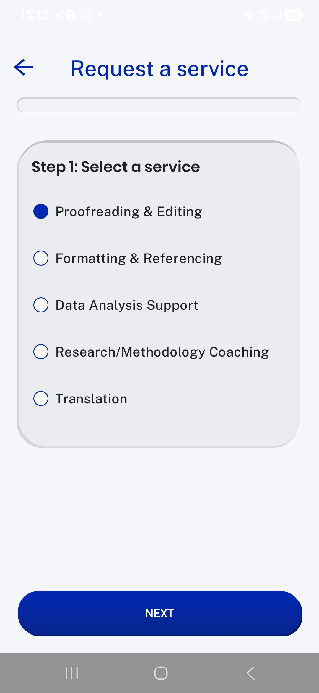
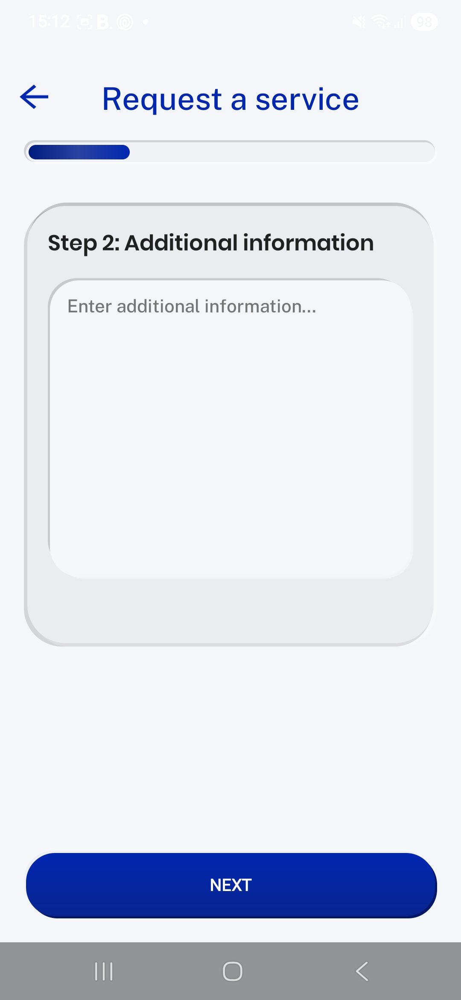 
 
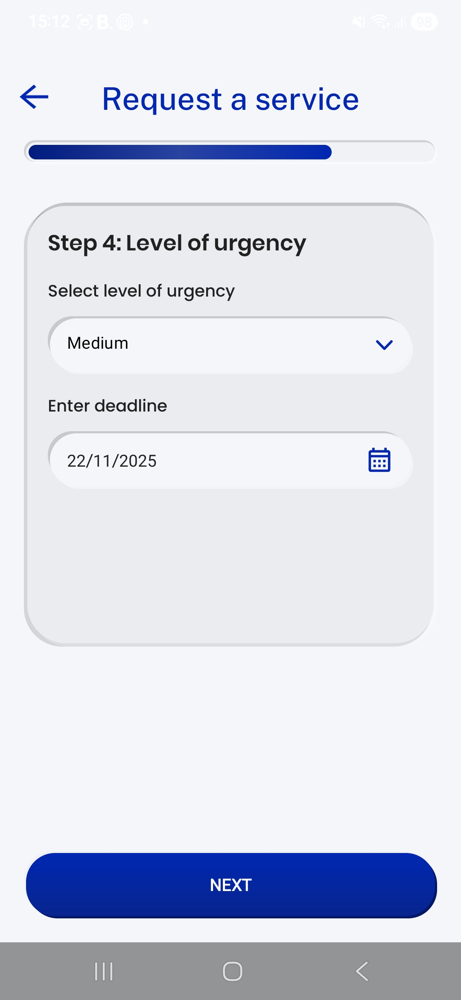 
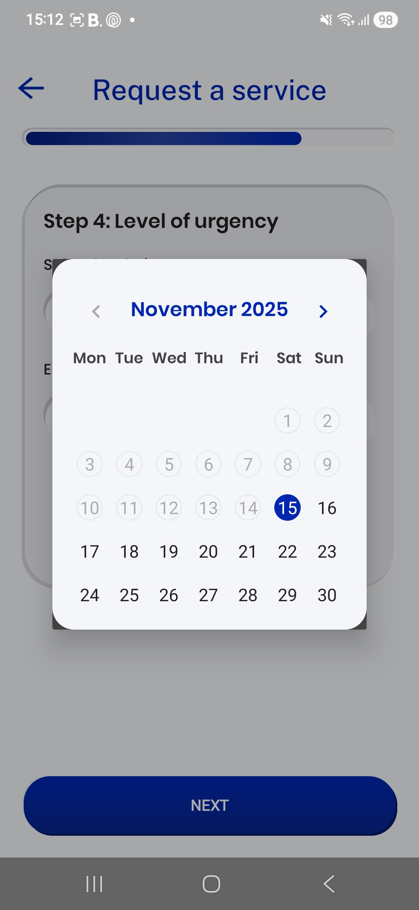 
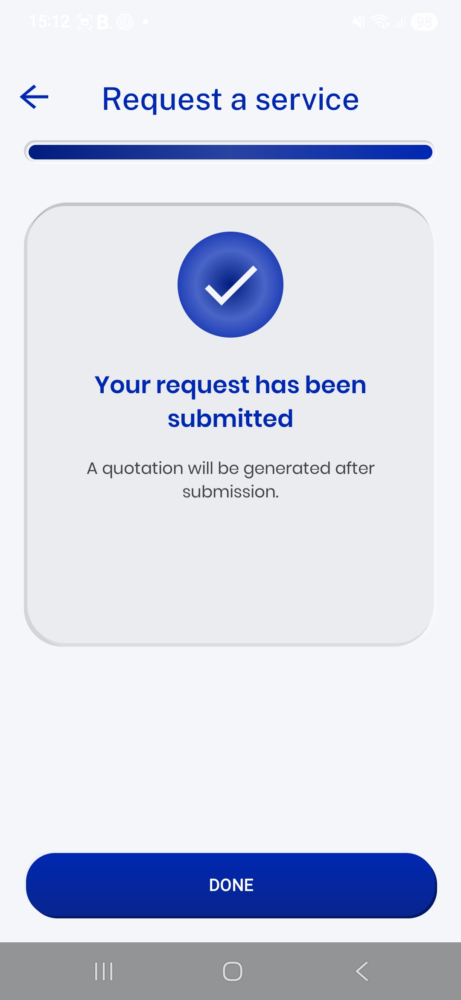 

 ### Student View all Requests
  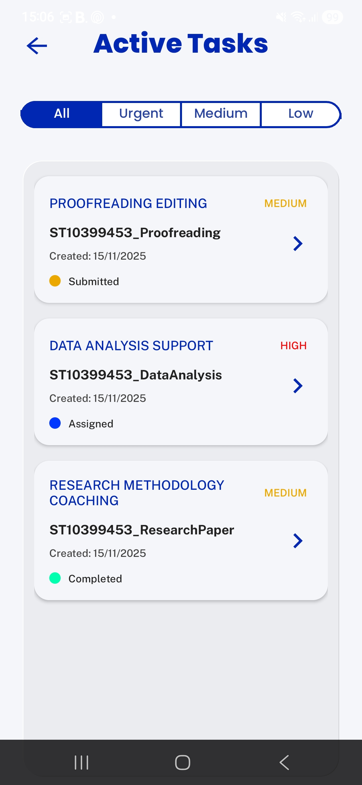 

 ### Student Resources
   

  ### Consultant Dashboard
  

  ### Consultant Assigned Tasks
  

   ### Consultant Provides Feedback
 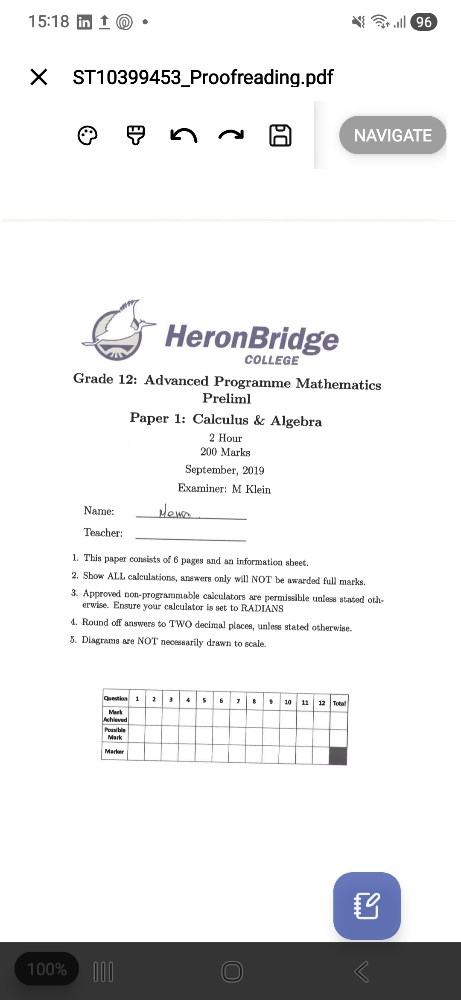 
 

  ### Messages
 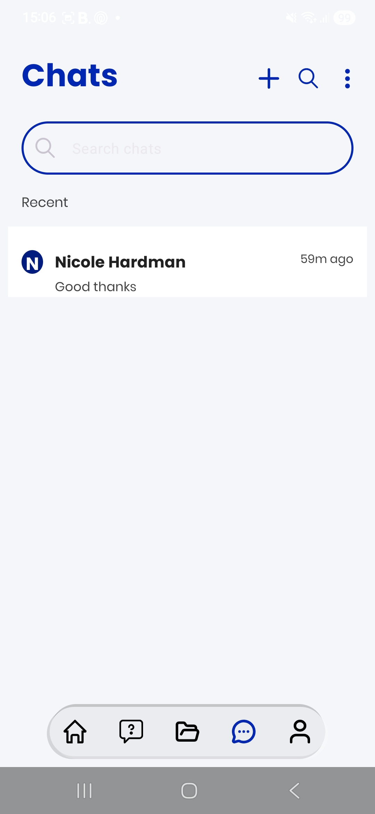 
 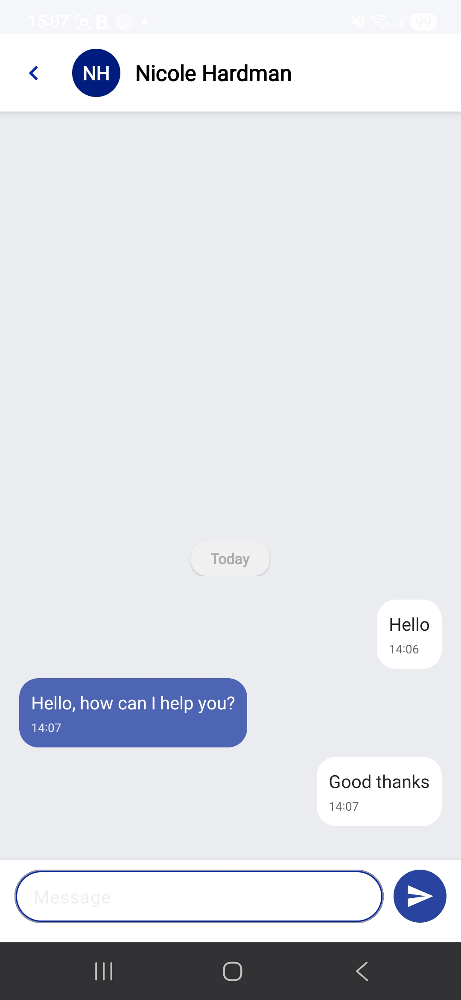 
  
  

  ### Admin Dashboard
 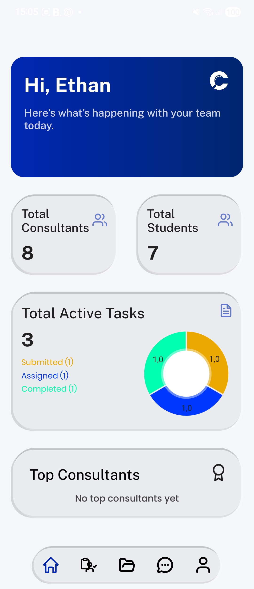 

   ### Admin Assign Consultant
  
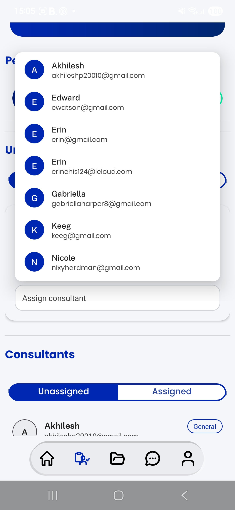

   ### Admin Resources
  

   ### Admin Add Resources
  


## Setup Instructions

### Prerequisites
Before setting up, ensure you have the following installed:

- Android Studio Narwhal Patch 4
- Windows 10 or later

### Installation Steps
- Clone or download the project repository.
- Open the solution in Visual Studio.
- Build the project (Ctrl + Shift + B).
- Run the application (click Run OR press F5).

## Links

### CiteWise Platform Walkthrough
[](https://youtu.be/_yIdpGbDg2M)

**Back up access:** 

- https://drive.google.com/uc?id=1AON-3u5ABLNzXCVUjiqaPlrY1r_k9R4z&export=download


Developed by Ethan Ruey Huntley, Akhilesh Parshotam, Connor Tre Van Buuren, Erin Chisholm, and Alicia Orren
```
